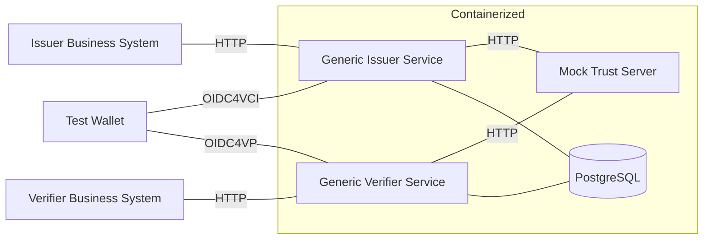

# SWIYU Generic Application Test

The Generic Application Test is a test system designed to run end-to-end (E2E) tests against the generic SWIYU [Issuer](https://github.com/swiyu-admin-ch/swiyu-issuer) and [Verifier](https://github.com/swiyu-admin-ch/swiyu-verifier) components.

Its primary goal is to validate the generic behavior of these components in isolation, without relying on a full trust infrastructure or real wallets. The system focuses on testing the issuance and verification flows, independently of any specific ecosystem or deployment.

This project starts the Issuer and Verifier services inside containers and interacts with them through HTTP calls using a fake (mocked) wallet. All other trust-related services are mocked to keep the test environment simple, deterministic, and focused.

## Table of Contents

- [Overview](#overview)
- [Prerequisites](#prerequisites)
- [Project Structure](#project-structure)
- [Configuration](#configuration)
- [Custom Profiles](#custom-profiles)
- [Contributions and feedback](#contributions-and-feedback)
- [License](#license)

## Overview

The test framework runs the Generic Issuer and Generic Verifier components inside containers, together with their required infrastructure (PostgreSQL and a mock server).

For E2E testing purposes, the Issuer Business System, Verifier Business System, and the Wallet are not deployed as real services. Their behavior is simulated by the tests in order to drive issuance and verification flows.

This setup allows us to test the containerized components in isolation, with fully controlled and deterministic external interactions.



## Prerequisites

Before running the tests, ensure you have the following tools and dependencies installed:

### Required Software

| Tool | Version | Purpose |
|------|---------|---------|
| **Java** | 21+ | Runtime for Maven and test execution |
| **Maven** | 3.8+ | Build tool and test runner |
| **Docker** | 20.10+ | Container runtime for services |

### Dependencies

This project uses **Testcontainers** to manage containerized services. Key dependencies include:

- `testcontainers`: Container management framework
- `testcontainers-junit-jupiter`: JUnit 5 integration
- `spring-boot-testcontainers`: Spring Boot integration
- `mockserver-client-java`: Mock server interaction

These are automatically managed by Maven via `pom.xml`.

Note that, container ports are dynamically mapped by Testcontainers, minimizing the risk of local port conflicts.

## Project Structure

This is a **multi-module Maven project** organized as follows:

- **test-wallet-library**: Contains reusable components including utilities, fixtures, test data builders, assertion helpers, and container configuration
- **test-wallet-application**: Contains the actual test classes and Spring Boot configurations. Tests are executed from this module using Spring Boot Test framework with custom profiles for different scenarios

## Configuration

### Environment Variables

The following environment variables can be used to configure the test execution:

| Variable | Purpose | Default | Example |
|----------|---------|---------|---------|
| `ISSUER_IMAGE_NAME` | Docker image name for the Issuer service | `ghcr.io/swiyu-admin-ch/swiyu-issuer` | `ghcr.io/swiyu-admin-ch/swiyu-issuer` |
| `ISSUER_IMAGE_TAG` | Docker image tag for the Issuer service | `dev` | `dev`, `stable`, `rc`, `staging` |
| `VERIFIER_IMAGE_NAME` | Docker image name for the Verifier service | `ghcr.io/swiyu-admin-ch/swiyu-verifier` | `ghcr.io/swiyu-admin-ch/swiyu-verifier` |
| `VERIFIER_IMAGE_TAG` | Docker image tag for the Verifier service | `dev` | `dev`, `stable`, `rc`, `staging` |
| `TRACE_TEST_REQUESTS` | Enable stack trace logging for each test | `false` | `true`, `false` |

### Trace Output

When `TRACE_TEST_REQUESTS=true` is set, detailed stack traces are generated during test execution. These traces are saved as Markdown files in the `target/traces/` directory, organized by test name. This feature is particularly useful for understanding the flow of happy path tests and debugging.

**Note**: Enabling tracing may cause some edge case tests to fail. It is recommended to use tracing primarily for analyzing happy path test flows.

## Custom Profiles

You can create custom Spring profiles to configure issuer and verifier services with different environment variables. This allows you to test various deployment scenarios without modifying the core test code.

### Creating a Custom Profile

1. Create a new configuration file in `test-wallet-application/src/main/resources/`:
   - `application-issuer{profile-name}.yml` or `application-verifier-{profile-name}.yml`- Contains Spring configuration

2. Update the corresponding image configuration class:
   - `IssuerImageConfig.java` or `VerifierImageConfig.java` - Add new properties

3. Update the container configuration class:
   - `IssuerContainerConfig.java` or `VerifierContainerConfig.java` - Add the new environment variables to the container builder

4. Activate the profile in your test class using the `@ActiveProfiles` annotation:

```java
@SpringBootTest
@ActiveProfiles("issuer-encryption")
class MyTest extends BaseTest {
    // Your test methods
}
```

## Contributions and feedback

We welcome any feedback on the code regarding both the implementation and security aspects.
Please follow the guidelines for contributing found in [CONTRIBUTING.md](/CONTRIBUTING.md).

## License

This project is licensed under the terms of the MIT license. See the [LICENSE](/LICENSE) file for details.