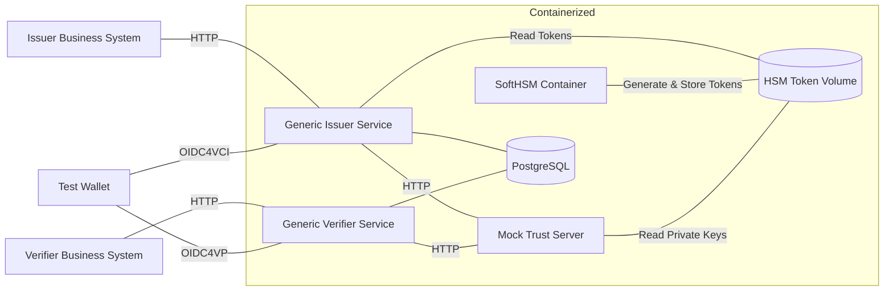

# swiyu Generic Application Test

The Generic Application Test is a test system designed to run end-to-end (E2E) tests against the generic swiyu [Issuer](https://github.com/swiyu-admin-ch/swiyu-issuer) and [Verifier](https://github.com/swiyu-admin-ch/swiyu-verifier) components.

Its primary goal is to validate the generic behavior of these components in isolation, without relying on a full trust infrastructure or real wallets. The system focuses on testing the issuance and verification flows, independently of any specific ecosystem or deployment.

This project starts the Issuer and Verifier services inside containers and interacts with them through HTTP calls using a fake (mocked) wallet. All other trust-related services are mocked to keep the test environment simple, deterministic, and focused.

## Table of Contents

- [Overview](#overview)
- [Prerequisites](#prerequisites)
- [Project Structure](#project-structure)
- [Test Environment Model](#test-environment-model)
- [Configuration](#configuration)
- [Version Regression Tests](#version-regression-tests)
- [Hardware Security Module (HSM) Integration](#hardware-security-module-hsm-integration)
- [Local Development and Testing](#local-development-and-testing)
- [Contributions and feedback](#contributions-and-feedback)
- [License](#license)

## Overview

The test framework runs the Generic Issuer and Generic Verifier components inside containers, together with their required infrastructure (PostgreSQL and a mock server).

For E2E testing purposes, the Issuer Business System, Verifier Business System, and the Wallet are not deployed as real services. Their behavior is simulated by the tests in order to drive issuance and verification flows.

This setup allows testing the containerized components in isolation, with fully controlled and deterministic external interactions.


```mermaid
flowchart LR
    issuer_bus[Issuer Business System]
    wallet[Test Wallet]
    verifier_bus[Verifier Business System]

    subgraph Containerized
        iss[Generic Issuer Service]
        ver[Generic Verifier Service]
        hsm[SoftHSM Container]

        mock[Mock Trust Server]
        db[(PostgreSQL)]
        tokens[(HSM Token Volume)]
    end

    issuer_bus -- HTTP --- iss
    verifier_bus -- HTTP --- ver
    
    wallet -- OIDC4VCI --- iss
    wallet -- OIDC4VP --- ver

    iss -- HTTP --- mock
    iss --- db
    iss -- Read Tokens --- tokens
    hsm -- Generate & Store Tokens --- tokens
    mock -- Read Private Keys --- tokens

    ver -- HTTP --- mock
    ver --- db
    
```

## Prerequisites

Before running the tests, ensure you have the following tools and dependencies installed:

### Required Software

| Tool | Version | Purpose |
|------|---------|---------|
| **Java** | 21+ | Runtime for Maven and test execution |
| **Maven** | 3.8+ | Build tool and test runner |
| **Docker** | 20.10+ | Container runtime for services |

### Dependencies

This project uses **Testcontainers** to manage containerized services. Key dependencies include:

- `testcontainers`: Container management framework
- `testcontainers-junit-jupiter`: JUnit 5 integration
- `spring-boot-testcontainers`: Spring Boot integration
- `mockserver-client-java`: Mock server interaction

These are automatically managed by Maven via `pom.xml`.

Note that container ports are dynamically mapped by Testcontainers, minimizing the risk of local port conflicts.

## Project Structure

This is a **multi-module Maven project** organized as follows:

- **test-wallet-library**: Contains reusable components including utilities, fixtures, test data builders, assertion helpers, and container configuration
- **test-wallet-application**: Contains the actual test classes and Spring Boot configurations. Tests are executed from this module using the Spring Boot Test framework with environment annotations for component variants

## Test Environment Model

E2E tests extend `BaseTest`, which acts as the environment provider for the test class. A test class declares the generic components it needs, and `BaseTest` ensures that the matching infrastructure and containers are running before the tests execute.

The environment is shared inside the same Maven/JVM test run:

- one PostgreSQL container;
- one schema per generic component configuration, such as `swiyu_issuer_default` or `swiyu_verifier_default`;
- one MockServer container acting as base registry, status list service, TP2 trust service, attestation key service, and callback endpoint;
- one Keycloak container when requested by a selected component or by `@UseSharedServices`;
- one SoftHSM container when requested by a selected component or by `@UseSharedServices`;
- one issuer/verifier container per selected variant.

MockServer routes are component-aware. DID documents, status lists, trust statements, renewal data, and callbacks are resolved by DID, status-list id, business id, or active component context rather than by a single global issuer.

### Declaring Components

Use class-level annotations to declare the issuer and verifier variants needed by a test class:

```java
@UseIssuers({IssuerVariant.DEFAULT, IssuerVariant.STRICT})
@UseVerifiers(VerifierVariant.DEFAULT)
class MultiIssuerFlowTest extends BaseTest {
    // tests
}
```

If no issuer or verifier annotation is present, `BaseTest` uses the default environment:

```java
class DefaultFlowTest extends BaseTest {
    // equivalent to @UseIssuers(DEFAULT) and @UseVerifiers(DEFAULT)
}
```

`@UseSharedServices` is optional. Use it only when a test needs a shared service even though none of its selected component variants implies it:

```java
@UseSharedServices(keycloak = true, hsm = true)
class SharedServiceContractTest extends BaseTest {
    // tests
}
```

Variants that require Keycloak or HSM start those shared services automatically.

### Using Components In Tests

`BaseTest` exposes named component handles:

```java
IssuerHandle defaultIssuer = issuer(IssuerVariant.DEFAULT);
IssuerHandle strictIssuer = issuer(IssuerVariant.STRICT);
VerifierHandle defaultVerifier = verifier(VerifierVariant.DEFAULT);
```

Each handle contains the container URL, business manager, service location, component config, image config, management auth data, and the issuer status list where relevant.

The wallet can switch explicitly between components:

```java
wallet.useIssuer(strictIssuer);
wallet.useVerifier(defaultVerifier);
wallet.useComponents(strictIssuer, defaultVerifier);
```

For test classes with a single issuer and verifier, the compatibility fields still point to the primary component:

- `issuerManager`;
- `issuanceService`;
- `verifierManager`;
- `issuerConfig`;
- `verifierConfig`;
- `currentStatusList`.

The primary component is the first declared variant. Without annotations, it is `DEFAULT`.

### Adding An Issuer Variant

Add issuer configurations through `IssuerVariant`.

1. Add the new enum value in `IssuerVariant`.
2. Give it a unique `surname`; this becomes part of the container/schema identity.
3. Set the variant flags, such as DPoP enforcement, signed metadata, JWT management auth, encryption enforcement, or HSM.
4. Extend `IssuerImageConfig` and `IssuerContainerConfig` only if the new variant requires a new environment variable.
5. Update `MockServerClientConfig` or `SwiyuEnvironmentRegistry` only if the variant needs new mocked external behavior.
6. Use the variant from tests with `@UseIssuers(...)`.
7. Run a targeted test first, then broaden to the full application suite if the change affects shared environment behavior.

Example:

```java
@UseIssuers(IssuerVariant.STRICT)
class IssuerStrictManagementTest extends BaseTest {
    // issuerManager points to STRICT
}
```

### Adding A Verifier Variant

Add verifier configurations through `VerifierVariant`.

1. Add the new enum value in `VerifierVariant`.
2. Give it a unique `surname`.
3. Set whether it requires HSM or Keycloak.
4. Extend `VerifierImageConfig` and `VerifierContainerConfig` only if the new variant requires a new environment variable.
5. Update MockServer or registry behavior only when the verifier needs new trust, status, callback, or TP2 mock behavior.
6. Use the variant from tests with `@UseVerifiers(...)`.
7. Run a targeted verifier test first, then broaden as needed.

Example:

```java
@UseVerifiers(VerifierVariant.MANAGEMENT_KEYCLOAK)
class KeycloakManagementAuthTest extends BaseTest {
    // verifierManager uses a bearer token issued by the shared Keycloak container
}
```

## Configuration

### Environment Variables

The following environment variables can be used to configure the test execution:

| Variable | Purpose | Default | Example |
|----------|---------|---------|---------|
| `ISSUER_IMAGE_NAME` | Docker image name for the Issuer service | `ghcr.io/swiyu-admin-ch/swiyu-issuer` | `ghcr.io/swiyu-admin-ch/swiyu-issuer` |
| `ISSUER_IMAGE_TAG` | Docker image tag for the Issuer service | `dev` | `dev`, `stable`, `rc`, `staging` |
| `VERIFIER_IMAGE_NAME` | Docker image name for the Verifier service | `ghcr.io/swiyu-admin-ch/swiyu-verifier` | `ghcr.io/swiyu-admin-ch/swiyu-verifier` |
| `VERIFIER_IMAGE_TAG` | Docker image tag for the Verifier service | `dev` | `dev`, `stable`, `rc`, `staging` |
| `TRACE_TEST_REQUESTS` | Enable stack trace logging for each test | `false` | `true`, `false` |
| `ISSUER_CONTAINER_LOGS` | Enable Issuer container logs | `true` | `true`, `false` |
| `VERIFIER_CONTAINER_LOGS` | Enable Verifier container logs | `true` | `true`, `false` |
| `DB_CONTAINER_LOGS` | Enable PostgreSQL container logs | `false` | `true`, `false` |
| `MOCKSERVER_CONTAINER_LOGS` | Enable MockServer container logs | `false` | `true`, `false` |
| `SOFTHSM_CONTAINER_LOGS` | Enable SoftHSM container logs | `false` | `true`, `false` |

Container logs are controlled per service. Issuer and Verifier logs are enabled by default; infrastructure container logs are disabled by default.

### Trace Output

When `TRACE_TEST_REQUESTS=true` is set, detailed stack traces are generated during test execution. These traces are saved as Markdown files in the `target/traces/` directory, organized by test name. This feature is particularly useful for understanding the flow of happy path tests and debugging.

**Note**: Enabling tracing may cause some edge case tests to fail. It is recommended to use tracing primarily for analyzing happy path test flows.

## Version Regression Tests

Version regression tests are opt-in and exercise a stateful `Previous` to `Candidate` transition on one component
schema. PostgreSQL and MockServer stay running while the Previous component is stopped and the Candidate component
starts and applies its database migrations. Issuer and Verifier transitions support independent versions, variants and
metadata; the currently implemented E2E flow covers only an offer created by the Previous Issuer and issued by the
Candidate Issuer.

Run it with explicit image versions:

```bash
./mvnw -Pversion-regression clean verify \
  -Dregression.issuer.previous.version=4.1.0 \
  -Dregression.issuer.candidate.version=4.2.0
```

Each descriptor also accepts `.variant` and `.metadata` properties. Metadata locations must use either
`classpath:...` or `file:...`. Equivalent environment variables use uppercase underscore names, for example
`REGRESSION_ISSUER_PREVIOUS_VERSION`, `REGRESSION_ISSUER_PREVIOUS_VARIANT`, and
`REGRESSION_ISSUER_PREVIOUS_METADATA`.

The standard `./mvnw clean verify` excludes the `version_regression` tag and does not start regression components.

To run only version regression tests from GitHub Actions, start the **Run E2E Tests** workflow, select
`version-regression`, set `issuer-image-tag` to the Candidate version, and provide `previous-issuer-image-tag`.
The optional `previous-verifier-image-tag` already configures a Verifier transition for future regression scenarios;
no Verifier regression E2E test is currently executed.

## Hardware Security Module (HSM) Integration

This test framework includes HSM integration using **SoftHSM** to simulate a real Hardware Security Module in a containerized test environment. This allows for realistic testing of HSM integration in generic components without requiring physical HSM hardware.

## Local Development and Testing

When making modifications to the [Issuer](https://github.com/swiyu-admin-ch/swiyu-issuer) or [Verifier](https://github.com/swiyu-admin-ch/swiyu-verifier) services, you can build and test these development versions locally without relying on pre-built registry images. This allows you to run full end-to-end tests against your own development builds.

### Prerequisites for Local Testing

In addition to the standard prerequisites, you need:

- Access to the [swiyu-issuer](https://github.com/swiyu-admin-ch/swiyu-issuer) repository (for testing Issuer modifications)
- Access to the [swiyu-verifier](https://github.com/swiyu-admin-ch/swiyu-verifier) repository (for testing Verifier modifications)

### Building and Preparing Local Images for Testing

Run the `prepare-local-testing.sh` script to build both development images locally and configure them for E2E testing:

```bash
source ./scripts/prepare-local-testing.sh
```

This script performs the following steps:

1. Builds Maven packages for both services (`mvn clean package -DskipTests`)
2. Creates Docker images with the `local` tag
3. Sets environment variables to use the locally built images:
   - `ISSUER_IMAGE_NAME=swiyu-issuer` and `ISSUER_IMAGE_TAG=local`
   - `VERIFIER_IMAGE_NAME=swiyu-verifier` and `VERIFIER_IMAGE_TAG=local`

After running this script, all subsequent test executions will use your locally built development images.

### Custom Repository Paths

By default, the script expects repositories at:
- `~/Git/swiyu-issuer`
- `~/Git/swiyu-verifier`

To use custom paths, set the environment variables before running the script:

| Variable | Purpose | Default |
|----------|---------|---------|
| `LOCAL_REPOSITORY_ISSUER_ROOT` | Path to local Issuer repository for development builds | `~/Git/swiyu-issuer` |
| `LOCAL_REPOSITORY_VERIFIER_ROOT` | Path to local Verifier repository for development builds | `~/Git/swiyu-verifier` |

### Reverting to Registry Images

Once you've finished testing your development builds, you can revert to using the pre-built images from GitHub Container Registry by unsetting the local image environment variables:

```bash
source ./scripts/cleanup-local-testing.sh
```

This script removes the environment variables set by `prepare-local-testing.sh`, allowing for subsequent tests to use the default registry images again.

## Contributions and feedback

We welcome any feedback on the code regarding both the implementation and security aspects.
Please follow the guidelines for contributing found in [CONTRIBUTING.md](/CONTRIBUTING.md).

## License

This project is licensed under the terms of the MIT license. See the [LICENSE](/LICENSE) file for details.
